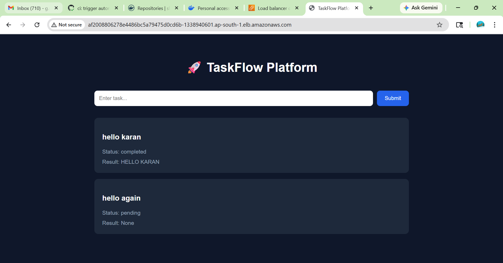
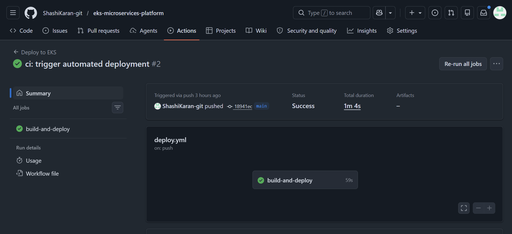
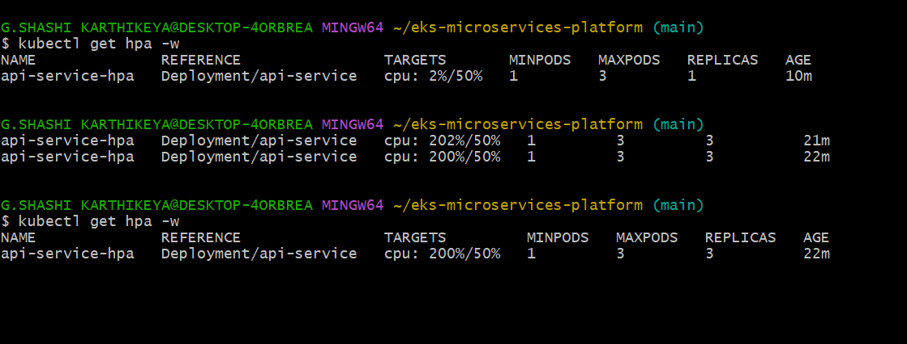
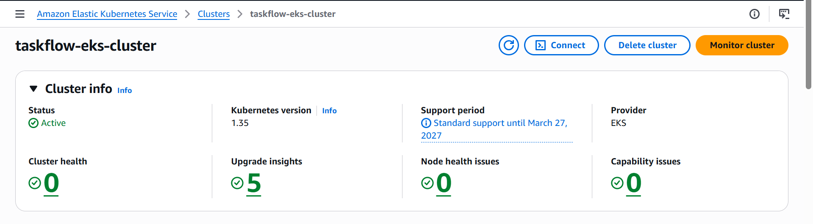

# 🚀 EKS Microservices Platform

A production-style cloud-native microservices platform built using Docker, Kubernetes, Helm, Terraform, AWS EKS, GitHub Actions, Redis, and PostgreSQL.

This project demonstrates modern DevOps workflows including:
- containerization
- Kubernetes orchestration
- Infrastructure as Code (IaC)
- CI/CD automation
- autoscaling
- cloud-native deployments

---

# 🏗 Architecture

```text
GitHub Actions
        ↓
Docker Hub
        ↓
AWS EKS
        ↓
Frontend Service
        ↓
API Service
        ↓
Redis Queue
        ↓
Worker Service
        ↓
PostgreSQL
```

---

# ✨ Features

- ⚡ Microservices architecture
- 🐳 Dockerized services
- ☸ Kubernetes orchestration
- 📦 Helm templating
- 🏗 Terraform infrastructure provisioning
- ☁ AWS EKS deployment
- 🔄 GitHub Actions CI/CD pipeline
- 📬 Redis-based async task queue
- 🗄 PostgreSQL persistence layer
- 📈 Horizontal Pod Autoscaling (HPA)
- 📊 Kubernetes metrics monitoring
- 🌐 Public LoadBalancer deployment

---

# 🧩 Services Overview

| Service | Purpose |
|---|---|
| Frontend | User interface |
| API Service | Backend REST API |
| Worker | Background task processor |
| Redis | Queue/message broker |
| PostgreSQL | Persistent database |

---

# 🔄 Async Processing Workflow

1. User submits task
2. API stores task in PostgreSQL
3. API pushes task into Redis queue
4. Worker consumes task asynchronously
5. Worker processes task
6. Database updates status/result
7. Frontend displays latest result

---

# ⚙ Tech Stack

- Python
- Flask
- Docker
- Kubernetes
- Helm
- Terraform
- AWS EKS
- GitHub Actions
- Redis
- PostgreSQL

---

# 📦 Local Development Setup

## Clone Repository

```bash
git clone https://github.com/ShashiKaran-git/eks-microservices-platform.git
cd eks-microservices-platform
```

---

## Run with Docker Compose

```bash
docker compose up --build
```

---

## Access Application

Frontend:
```text
http://localhost:3000
```
API:
```text
http://localhost:8000
```

---

# ☸ Kubernetes Deployment

## Apply Kubernetes Resources

```bash
kubectl apply -f k8s/
```

---

## Verify Pods

```bash
kubectl get pods
```

---

## Verify Services

```bash
kubectl get svc
```
---

# 📊 Monitoring & Observability

Implemented Kubernetes Metrics Server for:
- CPU monitoring
- memory monitoring
- resource visibility

Explored Prometheus + Grafana integration using Helm.

Due to infrastructure limitations on a single t3.small node, the full kube-prometheus-stack introduced resource pressure and pending pods.

To optimize cluster stability and cost efficiency:
- retained Metrics Server for lightweight observability
- used `kubectl top nodes` and `kubectl top pods`
- evaluated monitoring tradeoffs for small Kubernetes clusters

This reflects real-world infrastructure optimization decisions in resource-constrained environments.

---

# 🏗 Terraform Infrastructure Provisioning

## Initialize Terraform

```bash
terraform init
```

---

## Preview Infrastructure

```bash
terraform plan
```

---

## Create AWS Infrastructure

```bash
terraform apply
```

---

# 🚀 CI/CD Workflow

# 🔄 GitHub Actions CI/CD

Pipeline automatically:
- builds Docker images
- pushes images to Docker Hub
- connects to AWS EKS
- deploys application using Helm

Triggered automatically on:

```text
git push
```

```text
git push
    ↓
GitHub Actions
    ↓
Docker image build
    ↓
Push to Docker Hub
    ↓
Connect to AWS EKS
    ↓
Helm deployment
    ↓
Automatic Kubernetes rollout
```

---

# 📈 Horizontal Pod Autoscaling

Implemented Kubernetes HPA using Metrics Server.

The API service automatically scales based on CPU utilization.

Example:
- CPU load increased beyond threshold
- Kubernetes scaled API replicas from 1 → 3 automatically

---

# 📸 Screenshots

## Application Running on AWS EKS



---

## GitHub Actions CI/CD Pipeline



---

## Kubernetes Horizontal Pod Autoscaling



---

## AWS EKS Cluster



---

# 🧠 Challenges Faced & Lessons Learned

- Managed resource constraints on t3.small infrastructure
- Solved Kubernetes networking and service discovery issues
- Handled Helm ownership conflicts
- Debugged Git rebase and merge conflicts
- Optimized monitoring stack for low-resource clusters
- Resolved Terraform dependency cleanup issues
- Implemented autoscaling under generated load

---

# 🎯 Key Learnings

- Kubernetes orchestration
- Infrastructure as Code (Terraform)
- Helm templating
- GitHub Actions CI/CD
- AWS EKS deployments
- Horizontal Pod Autoscaling
- Distributed systems architecture
- Cloud-native networking
- Infrastructure optimization

---

# 👨‍💻 Author

Built as part of a cloud-native & DevOps engineering learning journey.
